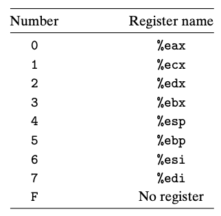

# Computer Systems Organisation (CS2.201)
## Summer 2021, IIIT Hyderabad
## Assignment 2

## Instruction
The instruction assigned is Instruction 1, *i.e.*, `OPl rA, D(rB)`.

## Task 1
### Byte 0
The icode part of the instruction will be `0xc` [as it differs from `0x6`, the instruction to operate on registers, in only one bit].  
The ifun part is the same as that instruction's – `0x0` for `addl`, `0x1` for `subl`, `0x2` for `andl`, and `0x3` for `xorl`.  

### Byte 1
The codes for `rA` and `rB` make up the next byte of the instruction. Their encoding is the usual scheme, shown in Figure 1.

### Bytes 2-5
The next four bytes represent `D`, the offset value.

Thus, for example, `addl %edi 4(%eax)` would be encoded as `0xc07000000004`. In binary,
    
    1110 0000 0111 0000 00000000 00000000 00000000 00000100

## Task 2
We will assume that

* the array's base address (`&A[0]`) is stored in memory at the location `8(%ebp)`.
* the index array's base address (`&I[0]`) is stored in memory at the location `12(%ebp)`.
* the increment value is stored in register `%edi`.

The code checks for 0 in the `I` array; if it is there, it subtracts `%edi` from `A[0]`. Then it checks for 1 in `I`; if it is there, it subtracts `%edi` from `A[1]`, and so on until 7. A loop was not used as the given instruction `OPl rA, D(rB)` does not support variable offset (`D` is a constant word).  

In each of  `check0`, `check1`, etc., the logic is exactly the same. Only the function called in the 5th line differs. Hence only the first one is commented. A similar reasoning holds for `add0`, `add1`, etc.  
    
    mrmovl 8(%ebp),  %esi   # %esi is &A[0]
    mrmovl 12(%ebp), %eax   # %edi is &I[0]
    irmovl $-16,     %ecx   # 16 is added to %ecx in the beginning of each loop
    
    irmovl $0,       %edx   # to check for 0 first
    
    # %ecx = 0, 4, 8, 12 in check0
    
    .check0:
    irmovl $16,      %ebx
    addl   %ebx,     %ecx   # add 16 to %ecx : i = 0 or i++
    addl   %eax,     %ecx   # now %ecx = &I[i]
    subl   %edx,     (%ecx)
    je .add0                # if 0 = I[i], add %edi to A[0]
    addl   %edx,     (%ecx) # undo subl
    subl   %eax,     %ecx   # now %ecx = i again
    irmovl $12,      %ebx
    subl   %ebx,     %ecx   # checking i == 3
    jne .check0             # if i = 3, exit
    
    call .done              # resets counters for check1 and increments %edx
    
     .check1:
    irmovl $16,      %ebx
    addl   %ebx,     %ecx
    addl   %eax,     %ecx
    subl   %edx,     (%ecx)
    je .add1
    addl   %edx,     (%ecx)
    subl   %eax,     %ecx
    irmovl $12,      %ebx
    subl   %ebx,     %ecx
    jne .check1
    
    call .done
    
    .check2:
    irmovl $16,      %ebx
    addl   %ebx,     %ecx
    addl   %eax,     %ecx
    subl   %edx,     (%ecx)
    je .add2
    addl   %edx,     (%ecx)
    subl   %eax,     %ecx
    irmovl $12,      %ebx
    subl   %ebx,     %ecx
    jne .check2
    
    call .done
    
    .check3:
    irmovl $16,      %ebx
    addl   %ebx,     %ecx
    addl   %eax,     %ecx
    subl   %edx,     (%ecx)
    je .add3
    addl   %edx,     (%ecx)
    subl   %eax,     %ecx
    irmovl $12,      %ebx
    subl   %ebx,     %ecx
    jne .check3
    
    call .done
    
    .check4:
    irmovl $16,      %ebx
    addl   %ebx,     %ecx
    addl   %eax,     %ecx
    subl   %edx,     (%ecx)
    je .add4
    addl   %edx,     (%ecx)
    subl   %eax,     %ecx
    irmovl $12,      %ebx
    subl   %ebx,     %ecx
    jne .check4
    
    call .done
    
    .check5:
    irmovl $16,      %ebx
    addl   %ebx,     %ecx
    addl   %eax,     %ecx
    subl   %edx,     (%ecx)
    je .add5
    addl   %edx,     (%ecx)
    subl   %eax,     %ecx
    irmovl $12,      %ebx
    subl   %ebx,     %ecx
    jne .check5
    
    call .done
    
    .check6:
    irmovl $16,      %ebx
    addl   %ebx,     %ecx
    addl   %eax,     %ecx
    subl   %edx,     (%ecx)
    je .add6
    addl   %edx,     (%ecx)
    subl   %eax,     %ecx
    irmovl $12,      %ebx
    subl   %ebx,     %ecx
    jne .check6
    
    call .done
    
    .check7:
    irmovl $16,      %ebx
    addl   %ebx,     %ecx
    addl   %eax,     %ecx
    subl   %edx,     (%ecx)
    je .add7
    addl   %edx,     (%ecx)
    subl   %eax,     %ecx
    irmovl $12,      %ebx
    subl   %ebx,     %ecx
    jne .check7
    
    call .done
    
    .exit:
    halt
    
    .done:
    irmovl   $-16,    %ecx  # reset %ecx
    irmovl   $1,      %ebx
    addl     %ebx,    %edx  # %edx <- %edx + 1 [search for next number in array I] 
    ret
    
    .add0:
    addl   %edx,     (%ecx) # undo subl
    subl   %eax,     %ecx   # undo subl
    addl   %edi,     (%esi) # increment A[0] by %edi
    call   .done            # resets counters for check1 and increments %edx
    jmp    .check1          # searches array I for 1
    
    .add1:
    addl   %edx,     (%ecx)
    subl   %eax,     %ecx
    addl   %edi,     4(%esi)
    call   .done
    jmp    .check2
    
    .add2:
    addl   %edx,     (%ecx)
    subl   %eax,     %ecx
    addl   %edi,     8(%esi)
    call   .done
    jmp    .check3
    
    .add3:
    addl   %edx,     (%ecx)
    subl   %eax,     %ecx
    addl   %edi,     12(%esi)
    call   .done
    jmp    .check4
    
    .add4:
    addl   %edx,     (%ecx)
    subl   %eax,     %ecx
    addl   %edi,     16(%esi)
    call   .done
    jmp    .check5
    
    .add5:
    addl   %edx,     (%ecx)
    subl   %eax,     %ecx
    addl   %edi,     20(%esi)
    call   .done
    jmp    .check6
    
    .add6:
    addl   %edx,     (%ecx)
    subl   %eax,     %ecx
    addl   %edi,     24(%esi)
    call   .done
    jmp    .check7
    
    .add7:
    addl   %edx,     (%ecx)
    subl   %eax,     %ecx
    addl   %edi,     28(%esi)
    jmp   .exit

## Task 3
The memory dump of the above code (assumed to start from `0x0`) is:

    0x000: 505600000008
    0x006: 50500000000c
    0x00c: 30f1fffffff0
    
    0x012: 30f200000000
    
    0x018:
    0x018: 30f300000010
    0x01e: 6031
    0x020: 6001
    0x022: c12100000000
    0x028: 73000001a0
    0x02d: c02100000000
    0x033: 6101
    0x035: 30f30000000c
    0x03b: 6131
    0x03d: 7400000018

    0x042: 8000000191
    
    0x047:
    0x047: 30f300000010
    0x04d: 6031
    0x04f: 6001
    0x051: c12100000000
    0x057: 73000001b8
    0x05c: c02100000000
    0x062: 6101
    0x064: 30f30000000c
    0x06a: 6131
    0x06c: 7400000047

    0x071: 8000000191
    
    0x076:
    0x076: 30f300000010
    0x07c: 6031
    0x07e: 6001
    0x080: c12100000000
    0x086: 73000001d0
    0x08b: c02100000000
    0x091: 6101
    0x093: 30f30000000c
    0x099: 6131
    0x09b: 7400000076

    0x0a0: 8000000191
    
    0x0a5:
    0x0a5: 30f300000010
    0x0ab: 6031
    0x0ad: 6001
    0x0af: c12100000000
    0x0b5: 73000001e8
    0x0ba: c02100000000
    0x0c0: 6101
    0x0c2: 30f30000000c
    0x0c8: 6131
    0x0ca: 74000000a5

    0x0cf: 8000000191
    
    0x0d4:
    0x0d4: 30f300000010
    0x0da: 6031
    0x0dc: 6001
    0x0de: c12100000000
    0x0e4: 7300000200
    0x0e9: c02100000000
    0x0ef: 6101
    0x0f1: 30f30000000c
    0x0f7: 6131
    0x0f9: 74000000d4

    0x0fe: 8000000191
    
    0x103:
    0x103: 30f300000010
    0x109: 6031
    0x10b: 6001
    0x10d: c12100000000
    0x113: 7300000218
    0x118: c02100000000
    0x11e: 6101
    0x120: 30f30000000c
    0x126: 6131
    0x128: 7400000103

    0x12d: 8000000191
    
    0x132:
    0x132: 30f300000010
    0x138: 6031
    0x13a: 6001
    0x13c: c12100000000
    0x142: 7300000230
    0x147: c02100000000
    0x14d: 6101
    0x14f: 30f30000000c
    0x155: 6131
    0x157: 7400000132

    0x15c: 8000000191
    
    0x161:
    0x161: 30f300000010
    0x167: 6031
    0x169: 6001
    0x16b: c12100000000
    0x171: 7300000248
    0x176: c02100000000
    0x17c: 6101
    0x17e: 30f30000000c
    0x184: 6131
    0x186: 7400000161

    0x18b: 8000000191
    
    0x190:
    0x190: 00
    
    0x191:
    0x191: 30f1fffffff0
    0x197: 30f300000001
    0x19d: 6032
    0x19f: 90
    
    0x1a0:
    0x1a0: c02100000000
    0x1a6: 6101
    0x1a8: c07600000000
    0x1ae: 8000000201
    0x1b3: 7000000047
    
    0x1b8:
    0x1b8: c02100000000
    0x1be: 6101
    0x1c0: c07600000004
    0x1c6: 8000000201
    0x1cb: 7000000076
    
    0x1d0:
    0x1d0: c02100000000
    0x1d6: 6101
    0x1d8: c07600000008
    0x1de: 8000000201
    0x1e3: 70000000a5
    
    0x1e8:
    0x1e8: c02100000000
    0x1ee: 6101
    0x1f0: c0760000000c
    0x1f6: 8000000201
    0x1fb: 70000000d4
    
    0x200:
    0x200: c02100000000
    0x206: 6101
    0x208: c07600000010
    0x20e: 8000000201
    0x213: 7000000103
    
    0x218:
    0x218: c02100000000
    0x21e: 6101
    0x220: c07600000014
    0x226: 8000000201
    0x22b: 7000000132
    
    0x230:
    0x230: c02100000000
    0x236: 6101
    0x238: c07600000018
    0x23e: 8000000201
    0x243: 7000000161
    
    0x248:
    0x248: c02100000000
    0x24e: 6101
    0x250: c0760000001c
    0x25b: 7000000190

## Task 4
The given instruction cannot be executed in one cycle given the current hardware. Memory access happens exclusively after the ALU's computation, which will not work as the sequence of operations for this instruction is read, compute, write.

The generic processing of this instruction happens as follows:

| Stage | Cycle 1 | Cycle 2 |
| :--- | :--- | :--- |
| Fetch | icode:ifun $\gets$ M$_1$[PC] | | 
| | `rA:rB` $\gets$ M$_1$[PC+1] | |
| | `valC` $\gets$ M$_4$[PC+2] | |
| | `valP` $\gets$ PC + 6 | |
| | | |
| Decode | `valA` $\gets$ R[`rA`] | `valA` $\gets$ `valA`|
| |  `valB` $\gets$ R[`rB`] | `valB` $\gets$ `valM`|
| | | |
| Execute | `valE` $\gets$ `valB` + `valC` | `valE'` $\gets$ `valA` OP `valB` |
| | | |
| Memory | `valM` $\gets$ M$_4$[`valE`] | M$_4$[`valE`] $\gets$ `valE'` |
| | | |
| Write-back | | |
| | | |
| PC update | | PC $\gets$ `valP` |

The first instance of the instruction is found at `0x022`; it is `c12100000000`, *i.e.*, `subl %edx, (%ecx)`. At this point, `%edx` contains 0 and `%ecx` (and `%eax`) contain the index array's base address (`&I[0]`).  
In that specific case, the processing happens as follows:

| Stage | Cycle 1 | Cycle 2 |
| :--- | :--- | :--- |
| Fetch | icode:ifun $\gets$ `0xc`:`0x1` | | 
| | `rA:rB` $\gets$ `0x1`:`0x2` | |
| | `valC` $\gets$ `0x0` | |
| | `valP` $\gets$ `0x028` | |
| | | |
| Decode | `valA` $\gets$ `0x0` | `valB` $\gets$ `I[0]` |
| |  `valB` $\gets$ `&I[0]` | |
| | | |
| Execute | `valE` $\gets$ `&I[0]` | `valE'` $\gets$ `I[0]` $-$ `0x0` |
| | | Set CC |
| | | |
| Memory | `valM` $\gets$ `I[0]` | M$_4$[`&I[0]`] $\gets$ `I[0]` |
| | | |
| Write-back | | |
| | | |
| PC update | | PC $\gets$ `0x28` |

Note that in PIPE, this constitutes a load/use hazard and therefore will take 3 cycles to complete. Further, some extra forwarding circuitry will be necessary.

## Task 5
Notes:

* The CCs are in the order `ZF`, `SF`, `OF`.
* The `I` array is assumed to be `[1,2,3,4]`.
* The `A` array is assumed to be `[2,3,5,7,11,13,17,19]`.
* The increment value is assumed to be `3`.
* All nonnegative values are in hexadecimal (preceded by `0x`). Negative values are in decimal for convenience.
* The stack pointer is assumed to be initialised to `0x300` before the program.

The first 20 cycles of the program run on SEQ as follows:

| Cycle | PC | CC | `%eax` | `%ecx` | `%edx` | `%ebx` | `%esp` | `%ebp` | `%esi` | `%edi` | Memory |
| :-- | :-- | :-- | :-- | :-- | :-- | :-- | :-- | :-- | :-- | :-- | :-- |
| 1 | `0x0` | `000` | `0x0` | `0x0` | `0x0` | `0x0` | `0x300` | `0x0` | `&A[0]` | `0x3` | - |
| 2 | `0x6` | `000` | `&I[0]` | `0x0` | `0x0` | `0x0` | `0x300` | `0x0` | `&A[0]` | `0x3` | - |
| 3 | `0xc` | `000` | `&I[0]` | `-16` | `0x0` | `0x0` | `0x300` | `0x0` | `&A[0]` | `0x3` | - |
| 4 | `0x12` | `000` | `&I[0]` | `-16` | `0x0` | `0x0` | `0x300` | `0x0` | `&A[0]` | `0x3` | - |
| 5 | `0x18` | `000` | `&I[0]` | `-16` | `0x0` | `0x10` | `0x300` | `0x0` | `&A[0]` | `0x3` | - |
| 6 | `0x1e` | `100` | `&I[0]` | `0x0` | `0x0` | `0x10` | `0x300` | `0x0` | `&A[0]` | `0x3` | - |
| 7 | `0x20` | `000` | `&I[0]` | `&I[0]` | `0x0` | `0x10` | `0x300` | `0x0` | `&A[0]` | `0x3` | - |
| 8-9 | `0x22` | `000` | `&I[0]` | `&I[0]` | `0x0` | `0x10` | `0x300` | `0x0` | `&A[0]` | `0x3` | `&I[0]` $\gets$ `2` |
| 10 | `0x28` | `000` | `&I[0]` | `&I[0]` | `0x0` | `0x10` | `0x300` | `0x0` | `&A[0]` | `0x3` | - |
| 11-12 | `0x2d` | `000` | `&I[0]` | `&I[0]` | `0x0` | `0x10` | `0x300` | `0x0` | `&A[0]` | `0x3` | `&I[0]` $\gets$ `2` |
| 13 | `0x33` | `100` | `&I[0]` | `0x0` | `0x0` | `0x10` | `0x300` | `0x0` | `&A[0]` | `0x3` | - |
| 14 | `0x35` | `000` | `&I[0]` | `0x0` | `0x0` | `0x0c` | `0x300` | `0x0` | `&A[0]` | `0x3` | - |
| 15 | `0x3b` | `010` | `&I[0]` | `-12` | `0x0` | `0x0c` | `0x300` | `0x0` | `&A[0]` | `0x3` | - |
| 16 | `0x3d` | `000` | `&I[0]` | `-12` | `0x0` | `0x0c` | `0x300` | `0x0` | `&A[0]` | `0x3` | - |
| 17 | `0x18` | `000` | `&I[0]` | `-12` | `0x0` | `0x10` | `0x300` | `0x0` | `&A[0]` | `0x3` | - |
| 17 | `0x1e` | `000` | `&I[0]` | `0x4` | `0x0` | `0x10` | `0x300` | `0x0` | `&A[0]` | `0x3` | - |
| 18 | `0x20` | `000` | `&I[0]` | `&I[1]` | `0x0` | `0x10` | `0x300` | `0x0` | `&A[0]` | `0x3` | - |
| 19-20 | `0x22` | `000` | `&I[0]` | `&I[1]` | `0x0` | `0x10` | `0x300` | `0x0` | `&A[0]` | `0x3` | `&I[1]` $\gets$ `3` |

## Task 6
We will assume that the index array `I` is `[1,2,3,4]`. Further, we will assume that the processor follows an "always-taken" branch-prediction strategy. In the given analysis, this goes wrong on the first use (`je` at `0x028`) and right on the second (`jne` at `0x3d`).  

The column headings in the figure are cycle numbers.  

Note that the instructions at `0x22`, `0x1a0` and `0x2d` are fetched twice as they need two cycles, with a bubble in between to allow for forwarding.

## Task 7
One such instruction can be `OPmovl rA, rB, rC`. This would calculate `R[rA] OP R[rB]` and put the result into `rC` without modifying the contents `rA` or `rB`.  

A new control signal would be needed for this as the instruction has three fields, so three register IDs need to be read in the fetch stage. Two of the values have to be read from the register file in decode, while the third would contain the destination register to use in the write-back stage.
