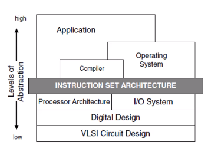

# Computer Systems Organisation (CS2.201)
## Summer 2021, IIIT Hyderabad
## 24 May, Monday (Lecture 1) - Introduction to Computer Systems

## Goal
To study the anatomy of a typical computer system.

## Course Outline
* Computer Arithmetic
* Instruction Set Architecture
* Processor Architecture and Design
* Memory Hierarchies
* Input/Output
* Virtual Memory

## Major Functional Units of a Computer
`Memory <-> I/O <-> ALU + Processor + Control`


## Program Execution on a Computer System
```
#include <stdio.h>

int main ()
{
    printf("hello, world\n");
}
```
The program is stored using the ASCII equivalents of each character.  

Compilation: `gcc -o hello hello.c`  


Running:  
`> ./hello`
`hello, world`

## Programming Abstractions
HLLs are more abstracted than assembly language, which is in turn more abstracted than machine code.  
More abstraction makes it easier to program, but we may lose fine-grained control over hardware.  

## Instruction Set Architecture (ISA)
The iSA is an sbstraction for the software/hardware interface. There can be multiple implementations of the same ISA, which is advantageous because then a program can run on all machines having a common ISA.  

