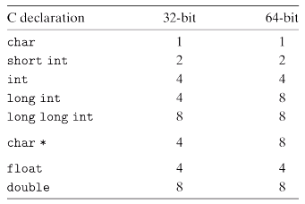

# Computer Systems Organisation (CS2.201)
## Summer 2021, IIIT Hyderabad
## 26 May, Wednesday (Lecture 2) – Integer Representation

Taught by Prof. Avinash Sharma

## Instruction Set Architecture (contd.)
The VLSI circuit design, digital design, processor architecture and I/O system are based on design choices made by the hardware maker.  
The ISA consists of

* the instruction set (`add`, `sub`, `mov`, `goto`),
* the instruction format (`add $1 $2`),
* data types and data structures (integer, floating point),
* addressing modes (32- or 64-bit address space), and
* exceptional conditions (flags).

If we implement complex instructions in the hardware, it results in a lot of redundancy. On the other hand, if a complex instruction is executed frequently, it can be efficient to do so. There is always a trade-off between simplicity and efficiency.

## Data Representation
All data is represented as bits (0s and 1s).  

In order to store and retrieve data, we need an address space. This space is determined by the length of the address (typically 32 or 64 bits). This is the same as the nominal size of pointer data, and is called the word size.  

Note that the _virtual_ address space (not to be confused with the virtual memory of a program) would consist of all possible words of the given word size. But the processor may not have an address with each such index; it is only the set of all possible addresses given the word size. For example, if the word size is 64, the virtual address space contains $2^{64}$ addresses, while the processor may not in fact have that much memory. There is a mapping between this virtual address space and the physical address space.

