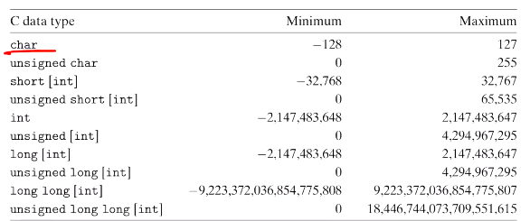
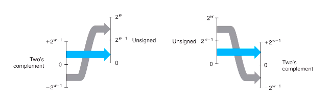

# Computer Systems Organisation (CS2.201)
## Summer 2021, IIIT Hyderabad
## 28 May, Friday (Lecture 3) – Integer Representation

Taught by Prof. Avinash Sharma

## Storage Format
Numbers have a binary, decimal and hexadecimal representations, and their binary representations are stored in memory.  
There are two conventions – little endian (LS byte first) and big endian (MS byte first). Note that the order of bits within each byte is consistent in both representations; only the order of bytes is flipped.

## Boolean Algebra and Shift Operations
Logical operations the unary function **NOT** (`!`) and the binary functions **AND** (`&&`), **OR** (`||`) and **XOR** (`^`).  
`!`, `&&` and `||` are *logical* operations; they treat nonzero values as logic 1 and the zero value as logic 0. They are *not* bitwise operators.  

Left and right shifts are both possible in C; however, the logical right shift operation is distinct from the arithmetic right shift operation. In the former, zeroes are added on the left, while in the latter, the MSB is duplicated as much as needed. This is because of the signed representation of integers.  



## Unsigned and Signed Integers
Obviously there are $2^w$ possible sequences of $w$ bits; we can associate decimal values with each of these according to our convenience.  

In the case of unsigned integers, we simply take the corresponding decimal value. Therefore the maximum value is $2^w - 1$ and the minimum value is 0.  

For signed integers, we have two representations. In the signed magnitude representation, we take the MSB as indicating the sign of the number. This gives us two representations for 0, so we have a maximum value of $2^{w-1} - 1$ and a minimum of $-2^{w-1}+1$.  
In the 2's complement representation, we take the numbers modulo $2^{w-1}$, keeping the range from $-2^{w-1}$ to $2^{w-1} - 1$. Thus there is an isomorphism between the unsigned and 2's complement values.  

Because of the difference in the ranges, conversion between signed and unsigned has some technicalities.




This could lead to bugs. Consider:  
```
float sum(float a[], unsigned length)
{
    int i;
    float result = 0;
    for (int i = 0; i <= length - 1; i++)
        result += a[i];
    return result;
}
```  
When `length` is cast to signed, if its value is 8, then `i` gets compared to `-1`, and the loop never runs.  


One must also be careful when extending the size of signed integers – the extra spaces need to be filled with all 1s. To understand why, consider the example `1011` extended to 8 bits. We can consider the signed values as $-$(MSB value) $+$ (value of remaining bits); therefore, when we extend it, two times the MSB gets added to the value (it goes from $-8+3$ to $8+3$). Then, we need to remove this amount. We note that 2 times 8 is equal to $-128+64+32+16$; this is equivalent to having 1s in the beginning of the number.  
