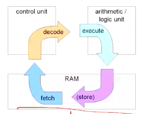

# Computer Systems Organisation (CS2.201)
## Summer 2021, IIIT Hyderabad
## 02 June, Wednesday (Lecture 5) – Instruction Set Architecture/Assembly Language Programming

Taught by Prof. Avinash Sharma

## Instruction Set Architecture
x86-64 describes the behaviour of the program as if each instruction is executed in sequence, but the processor hardware in fact executes many instructions concurrently. However, there exist safeguards at a layer of abstraction below the ISA that ensure that the overall behaviour does not change.  
Machine-level programs use a virtual address space, but the actual implementation involves multiple hardware memories and OS software.  

The most sensible way to give meaning to an assembly language is an operational or interpreter semantics – for each operation, we give the effect that execution of an operation has on the state of the machine.  

The most fundamental abstraction for x86 machine semantics is the fetch-decode-execute cycle, which involves the following steps:  
1. fetch the next instruction (according to PC)  
2. decode the instruction in the control unit  
3. execute the instruction, update the state and repeat.  

  

## Assembly Code
It is very close to machine code, but in a more readable text format as compared to the binary format of machine code. It enables visibility to key process states like the registers and the PC.  

## Instruction Format
IA32 instructions can be from 1 to 15 bytes long. It is designed so that common instructions and those with fewer operands require fewer bytes.  
In 32 bits, the first few bits hold the opcode and the remaining bits hold the arguments.
