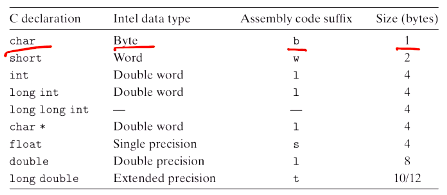
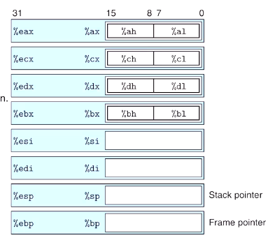
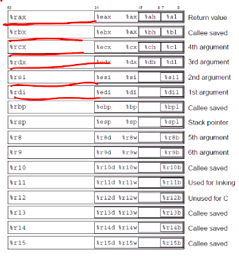
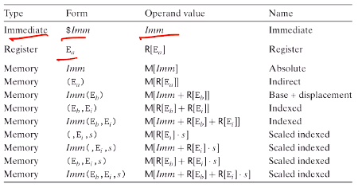

# Computer Systems Organisation (CS2.201)
## Summer 2021, IIIT Hyderabad
## 04 June, Friday (Lecture 6) – Instruction Set Architecture/Assembly Language Programming

Taught by Prof. Avinash Sharma

## Instruction Format (contd.)
The instruction format is designed in such a way that there is always a unique decoding of a sequence of bytes into machine instruction.  

## Assembly Code Example
Consider the C code
    
    int accum = 0;
    int sum(int x, int y)
    {
        int t = x + y;
        accum += t;
        return t;
    }

Its assembler output is
    
    sum:
        pushl %ebp
        movl  %esp, %ebp
        movl  12(%ebp), %eax
        addl  8(%ebp), %eax
        addl  %eax, accum
        popl  %ebp
        ret
    
The first two lines only update the status; push the current address on the stack and store the current function's address.  
The next three lines carry out the addition of `x` and `y` and update the value of `accum`. At this point, `t` is stored in `%eax`, which is returned by default; therefore the `ret` instruction returns it.  

## Processor State
The PC (`%eip`) indicates the address of the next instruction to be executed and cannot be used for any other purpose.  
The integer register file contains 8 locations storing 32-bit values, which can hold data, addresses, local variables or the return value.  
The condition code registers hold information about the most recently executed arithmetic or logical operation. They are used to implement conditional branching.  

## Data Formats
"Word" in IA32 refers to a 16-bit (2-byte) datatype.

  

In x86-64, `long long int` is supported using the `quad` datatype, which needs 8 bytes.  

## Accessing Information: Registers
  

Out of the 8 registers, the first 6 are general-purpose (unless the instruction uses a specific register as a source or a destination).  
The LS 2 bytes or 1 byte of the first four registers can be independently read or written by the byte operation instructions. For the remaining instructions, only the LS 2 bytes can be read or written.  

In x86-64, there are 8 more registers, and all the registers have 64 bits.

  

Most instructions have one or more operands (source and destination).  
There are three types of arguments: constant, register and memory. Values can be absolute, scaled or indexed.

  
