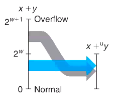
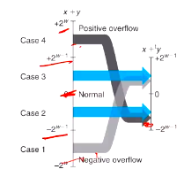

# Computer Systems Organisation (CS2.201)
## Summer 2021, IIIT Hyderabad
## 31 May, Monday (Lecture 4) – Integer Representation

Taught by Prof. Avinash Sharma

## Integer Addition
The sum of two $w$-bit numbers may not fit in $w$ bits; it can take up to $w+1$. This leads to overflow. The extra bits on the left are truncated.

In the unsigned case, $2^w$ is subtracted from large values.  
In the signed case (2's complement), large negative values are added to $2^w$, and $2^w$ is subtracted from large positive values.  

Note that this is simply modular arithmetic.  

## Negation (Signed Integers)
All numbers are properly negated except `INT_MIN` ($-2^{w-1}$); this number, when negated, does not change.

## Integer Multiplication
The product of two $w$-bit numbers can require up to $2w$ bits. It is truncated to its value modulo $2^w$.  
The signed case is done by considered the numbers to be unsigned and converting the product back to signed.  

When a variable is multiplied with a constant, the compiler tries to find the representation of the constant in terms of powers of 2, and the product is calculated using the shift operation.  

## 1's Complement Representation
One alternative representation of signed integers is the 1's complement representation, wherein the bitwise complement of the number is used to indicate its negation. In this system, just as with the signed magnitude system, there are distinct representations for $+0$ and $-0$.  
