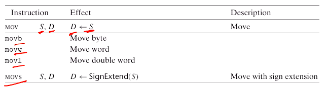
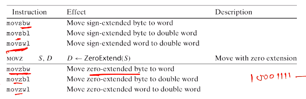

# Computer Systems Organisation (CS2.201)
## Summer 2021, IIIT Hyderabad
## 07 June, Monday (Lecture 7) – Assembly Language Programming

Taught by Prof. Avinash Sharma

## Data Movement Instructions
They are generally used to copy data from one location to another, but cannot be used to move between two memory locations. A register must be involved.  
Further, an immediate value cannot be the second operand.  

The character suffixes on `mov` indicates the:

* extension method: `z` for zero-extended and `s` for sign extended
* source data size: `b` for byte, `w` for word and `l` for double word
* destination location size: as for source.  

When the latter two are identical, we only specify one and leave out the extension method.  

In x86-64, for sign extension we have `movsbq`, `movswq` and `movslq` analogously. In the case of zero-extension, however, we only need `movzbq` and `movzwq`, since copying from 4 to 8 bytes automatically extends it with zeroes.  

The `push` instruction takes an argument `S` and is equivalent to
    
    R[%esp] <- R[%esp] - 4
    M[R[%esp]] <- S
    
The `%esp` (stack pointer) register points to the memory location which is the "top" of the stack, but in reality addresses increase towards the base of the stack. Therefore we decrement the address in order to push.  
    
The `pop` instruction, similarly, takes an argument `D` and is equivalent to

    D <- M[R[%esp]]
    R[%esp] <- R[%esp] + 4

Consider the C code:
    
    int exchange (int *xp, int y)
    {
        int x = *xp;
        *xp = y;
        return x;
    }

It compiles to
    
    -- xp at %ebp+8 and y at %ebp+12
    movl 8(%ebp), %edx  [Get xp]
    movl (%edx), %eax   [x = *xp, becomes return value]
    movl 12(%ebp), %ecx [Get y]
    movl %ecx, (%edx)   [Store y at xp]

