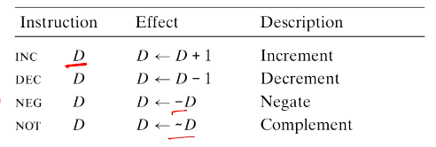
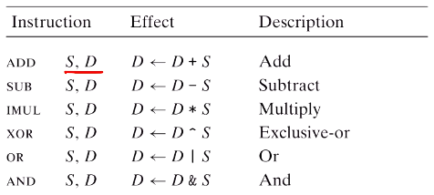
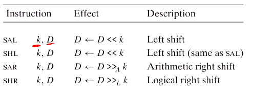
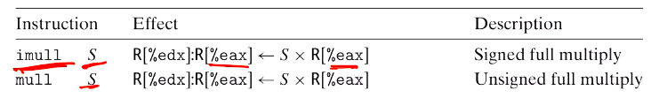
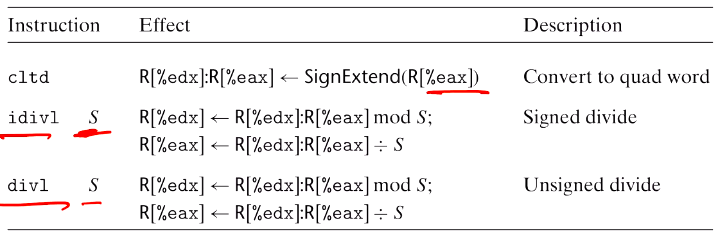

# Computer Systems Organisation (CS2.201)
## Summer 2021, IIIT Hyderabad
## 09 June, Wednesday (Lecture 8) – Arithmetic and Logical Instructions

Taught by Prof. Avinash Sharma

## The `leal` Instruction
The `leal` instruction (load effective address) moves the _address_ of the source into the destination. For example, running
    
    leal 0xff(%eax,%edx,4) %ecx

means that `%ecx` would contain the address `0xff + %eax + 4 * %edx`.  

This instruction is often used for arithmetic operations.  

However, the second operand must be a register. It cannot be a memory location.  

## Unary and Binary Instructions
There are four unary instructions.

The single operand can be either a register or a memory location.  

The binary operations are

## Shift Operations
There are four shift operations.

For the shift value $k$, we can pass an immediate value _or_ the value stored in the LS byte of the `%ecl` register, *i.e.*, `%cl`. No other register can be used for this.  

## Example
Consider the C code
    
    int arith(int x, int y, int z)
    {
        int t1 = x + y;
        int t2 = z * 48;
        int t3 = t1 & 0xFFFF;
        int t4 = t2 * t3;
        return t4;
    }

This compiles to
    
    -- x at %ebp+8, y at %ebp+12, z at %ebp+16
    movl 16(%ebp), %eax
    leal (%eax,%eax,2), %eax [z*3]
    sall $4, %eax            [z*48 -> t2]
    movl 12(%ebp), %edx      [y]
    addl 8(%ebp), %edx       [x+y -> t1]
    andl $65535, %edx        [t1 & 0xFFFF -> t3]
    imull %edx, %eax         [t2 * t3 -> t4]
    
Note the optimisation carried out by the compiler that breaks multiplying by 48 down to multiplying by 3 and then multiplying by 16.

## Special Arithmetic Operations
We know that the overflow of multiplication operations is a common problem.   Therefore, there are two instructions that multiply two numbers and store them in _two_ registers.

Since the multiplicand is considered to be `%eax` in both these cases, we cannot pass `%eax`.  

Similarly, in division, we can allow the dividend to be a value stored in two registers. The quotient is stored in one of them and the remainder in the other.

Analogous to multiplication, we cannot pass `%edx` or `%eax`, since they form the divididend.
