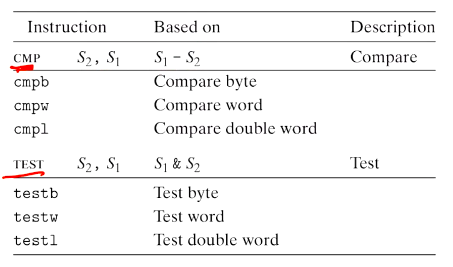
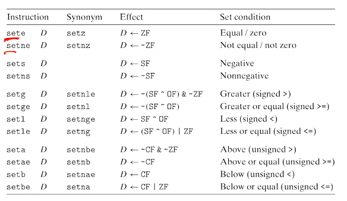

# Computer Systems Organisation (CS2.201)
## Summer 2021, IIIT Hyderabad
## 11 June, Friday (Lecture 9) – Condition Codes

Taught by Prof. Avinash Sharma

## Condition Codes
The CPU maintains a set of single-bit condition code registers describing attributes of the most recent arithmetic or logical operation.  
Some of them are

* `CF` (the carry flag) – carry out of the MSB; used to detect overflow of unsigned operations
* `ZF` (zero flag)
* `SF` (sign flag)
* `OF` (overflow flag) – 2's complement overflow  

For example, if `t = a + b` is the last executed operation, then the flags are set in the following cases:

`CF`: `(unsigned)t < (unsigned)a`  
`ZF`: `(t == 0)`  
`SF`: `(t < 0)`  
`OF`: `(a < 0 == b < 0) && (t < 0 != a < 0)` [*i.e.*, `a` and `b` have same sign but `t` and `a` have opposite sign]  

All operations except `leaq` set some condition codes.

For logical operations, `CF` and `OF` are set to 0.

For shift operations, `CF` is the last bit shifted out and `OF` is 0.

The `inc` and `dec` instructions set `OF` and `ZF` but don't affect `CF`.

## Conditional Instructions
There are two instruction classes – `cmp` and `test` – that set the condition codes.

They are similar to `sub` and `and` respectively, but do not alter the destination register.  

## Use Cases
There are three common ways to use the condition codes:

* Conditionally set a single byte to 0 or 1 (`set` instructions)
* Conditionally jump to some other part of the program (Control Flow Transfer)
* Conditionally move data (Data Flow Transfer)

The `set` instruction class is used to read the condition codes.

Note that the instruction suffixes are not the data type but the comparison operation to be read.  
For example, for `a < b`, where `a` is in `%edx` and `b` in `%eax`:
    
    cmpl %eax, %edx
    setl %al
    movzbl %al, %eax
