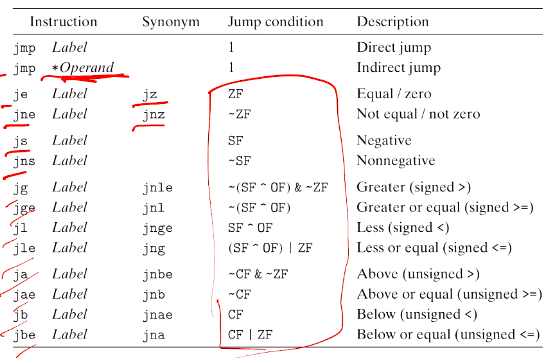
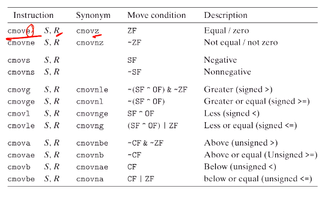

# Computer Systems Organisation (CS2.201)
## Summer 2021, IIIT Hyderabad
## 14 June, Monday (Lecture 10) – Conditional Branching

Taught by Prof. Avinash Sharma

## Jump Instructions
Jump instructions can be either direct (to a label) or indirect (to a value stored in a register).  

There are various jump instructions, both conditional and non-conditional.

Before linking, the location is passed to the jump instruction using program-relative addressing: the difference between the PC's contents and the jump destination is given. For example, the `.o` file and its disassembled version could be
    
    8: 7e 0d            jle 17
    a: 89 d0            mov %edx, %eax
    c: d1 f8            sar %eax
    e: 29 c2            sub %eax, %edx
    10: 8d 14 52        lea (%edx,%edx,2), %edx
    13: 85 d2           test %edx, %edx
    15: 7f f3           jg a
    17: 89 d0           mov %edx, %eax

where, in the first line, `0d` indicates that the destination is `0x0a + 0x0d`, or 17.  

After linking, the absolute addresses are given.

    804839c: 7e 0d            jle 80483ab
    804839e: 89 d0            mov %edx, %eax
    80483a0: d1 f8            sar %eax
    80483a2: 29 c2            sub %eax, %edx
    80483a4: 8d 14 52         lea (%edx,%edx,2), %edx
    80483a7: 85 d2            test %edx, %edx
    80483a9: 7f f3            jg 804839e
    80483ab: 89 d0            mov %edx, %eax

## Branches
Consider the C code

    int absdiff (int x, int y)
    {
        if (x < y)
            return y - x;
        else
            return x - y;
    }

The assembly code is
    
    -- x at %ebp+8, y at +12
      movl 8(%ebp), %edx
      movl 12(%ebp), %eax
      cmp  %eax, %edx
      jge  .L2
      subl %edx, %eax
      jmp  .L3
    .L2
      subl %eax, %edx
      movl %edx, %eax
    .L3
      ret

Therefore the general format to convert `if t {then} else {else}` is, therefore,
    
      if (!t)
        goto false;
      then;
      goto done;
    false:
      else;
    done:
    ...

However, if the original code was
    
    int absdiff(int x, int y)
    {
        return (x < y ? y-x : x-y)
    }

it is converted to
    
    movl  8(%ebp), %edx
    movl  12(%ebp), %eax
    movl  %edx, %ebx
    subl  %ecx, %ebx
    movl  %ecx,%ebx
    subl  %edx, %eax
    cmpl  $edx, %ecx
    cmovl %ebx, %eax

where the last statement is a "conditional move", which is executed if `x < y`.  

There are analogous conditional move instructions for all operations.

