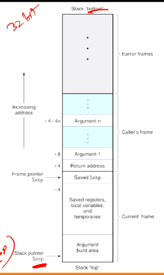
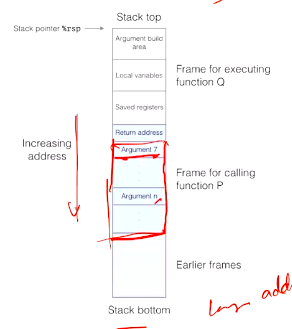
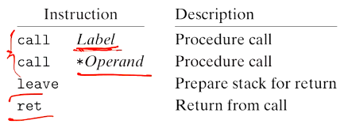
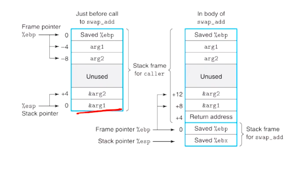

# Computer Systems Organisation (CS2.201)
## Summer 2021, IIIT Hyderabad
## 21 June, Monday (Lecture 12) – Procedures

Taught by Prof. Avinash Sharma

## Procedures
A procedure call involves passing control as well as data (parameters and return values) from one part of a program to another. This is handled by manipulating the stack. Local variables of the procedure also need to be allocated space.

### Stack Frames
The stack frame (or activation record) is the collection of all data on the stack associated with one function call. It generally includes

* the return address
* argument variables
* local variables
* saved copies of registers modified by the function that need to be restored.

A local variable that cannot be stored in the registers is stored in the stack. This can occur because:

* there are not enough registers
* some of the local variables are arrays or structures
* `&` is applied to the variable and therefore it must have an address

The caller function also stores the arguments of the callee in the stack (in the argument build area).

The end of the caller's frame is the return address of the callee, and the callee's frame starts with the saved value of the frame pointer.

However, in x86-64,  only the 7th argument onwards is stored in the argument build area. The other aspects of stack composition are similar to IA32.

### Transferring Control
The `call` instruction simply pushes the return address on the stack and jumps to the start of the callee. The `ret` instruction pops an address off the stack and jumps to that instruction.

### Register Usage Conventions
The callee is free to overwrite the `%eax`, `%ecx` and `%edx` registers (caller-save registers), since they are stored by the caller.  
However, the callee must store the values of `%ebx`, `%esi` and `%edi` (callee-save registers) before modifying them, because the caller does not store these.

Consider the function
    
    int P(int x)
    {
    int y = x*x;
    int z = Q(y);
    return y+z;
    }

`y` must survive after calling Q as well. Therefore P can store `y` either in its own stack frame before calling Q, or in a callee-save register.

Consider the functions
    
    int swap_add(int *xp, int *yp)
    {
        int x = *xp;
        int y = *yp;
        *xp = y;
        *yp = x;
        return x + y;
    }
    
    int caller()
    {
        int arg1 = 534;
        int arg2 = 1057;
        int sum = swap_add(&arg1, &arg2);
        int diff = arg1 - arg2;
        return sum * diff;
    }

The relevant states of the stack are

and the equivalent assembly code is
    
    caller:
      push1 %ebp
      movl %esp, %ebp       
      subl $24, %esp
      movl %34, -4(%ebp)
      movl $1057, -8(%ebp)
      leal -8(%ebp), %eax
      movl %eax, 4(%esp)
      leal -4(%ebp), %eax
      movl %eax, (%esp)
      call swap_add

    swap_add:
      push1 %ebp
      movl %esp, %ebp
      pushl %ebx
      movl 8(%ebp), %edx
      movl 12(%ebp), %ecx
      movl (%edx), %ebx
      movl (%ecx), %eax
      movl %eax, (%edx)
      movl %ebx, (%ecx)
      addl %ebx, %eax
      popl %ebx
      popl %ebp
      ret
