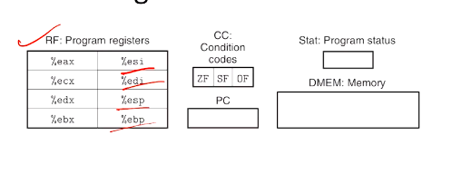
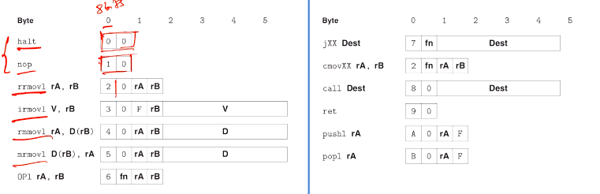
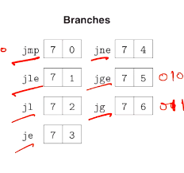
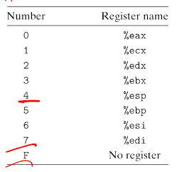
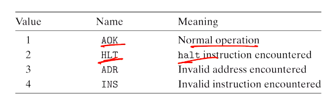

# Computer Systems Organisation (CS2.201)
## Summer 2021, IIIT Hyderabad
## 23 June, Wednesday (Lecture 13) – Processor Architecture and Design

Taught by Prof. Avinash Sharma

### Recursion
It is implemented in a similar way to other function calls. Consider the code
    
    int rfact(int n)
    {
        int result;
        if (n <= 1)
            result = 1;
        else
            result = n * rfact(n-1);
        return result;
    }

which compiles to
    
    rfact:
      push1 %ebp
      movl %esp, %ebp
      pushl %ebx
      subl $4, %esp
      movl 8(%ebp), %ebx
      movl $1, %eax
      cmpl $1, %ebx
      jle .L53
      leal -1(%ebx), %eax
      movl %eax, (%esp)
      call rfact
      imull %ebx, %eax
    .L53:
      addl $4, %esp
      popl %ebx
      popl %ebp
      ret

## CISC vs RISC
The complex instruction set architecture (CISC) – Intel's philosophy – encourages a large number of instructions, some of which may have long execution time and variable length. There may also be multiple formats to specify operands.  
The reduced instruction set architecture (RISC) – promoted by IBM – encourages fewer instructions, which execute relatively quicker and which have fixed length. The addressing formats are also usually simple.  

RISC does not allow memory locations as operands for arithmetic and logical operations, while CISC does. Further, unlike CISC, it exposes implementation artefacts to machine-level programs.

RISC also has no condition codes and uses register-intensive (up to 32 registers) procedure linkage. CISC, on the other hand, uses condition codes and stack-intensive procedure linkage.

## Y86 ISA
The Y86 ISA is a combination of RISC and CISC. It is an emulator for understanding the executing behaviour of x86-64. It can be considered as a simplification of a CISC ISA by applying some RISC principles.  

It has fewer data types, instructions and addressing modes, and a simpler byte-level encoding. It includes only 4-byte integer operations (which we call "words" without ambiguity).

### Program State
The state of the program is determined by eight registers, three condition codes, a program counter and the program status. 

Two of the registers are used for stack manipulation as in x86-64.

The memory is conceptually a large array of bytes, referenced by virtual addresses, which a combination of hardware and OS software translates to physical (actual) addresses.

The status code `Stat` indicates either a normal operation or an exception.

### Instruction Format
Y86's instruction format is as follows (each column is 1 byte):

The halt instruction stops execution, with the status code set to `HLT`.

The arithmetic instructions set the condition codes `ZF`, `SF` and `OF`.

For conditional jumping or moving, there are 6 possible branches (identified by the `fn` field in the instruction):

Each register has an ID. They are stored in the CPU in a register file.

There are four possible states or exceptions.

When an exception is encountered, the processor simply stops execution; there is no exception-handling.

### Y86 Programs
Y86 is essentially the same as IA32, except it sometimes needs 2 instructions for one instruction in the latter. Also, it does not follow the callee-save convention of IA32.  

In Y86, words beginning with `.` are assembler directives – they tell the assembler to adjust the address at which code is being generated. All Y86 programs start at address 0.
