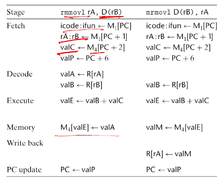
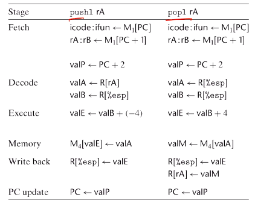
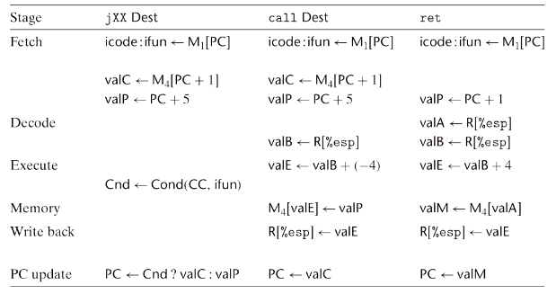
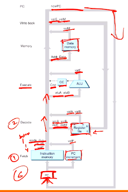
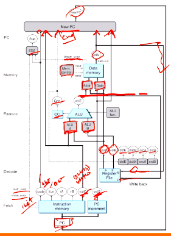
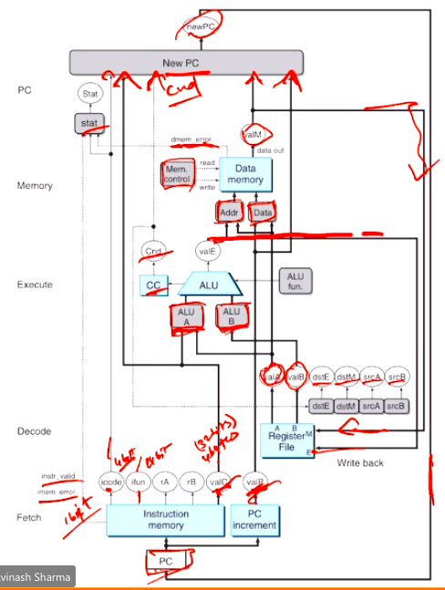

# Computer Systems Organisation (CS2.201)
## Summer 2021, IIIT Hyderabad
## 25 June, Friday (Lecture 14) – Y86 Implementation

Taught by Prof. Avinash Sharma

## Sequential Y86 Implementations
The speed of a computer processor is determined by the clock cycle. Depending on the type of processor, one or more instructions per cycle can be executed.  

As a first step, we will describe a processor called SEQ that performs all steps to process an instruction in a single clock cycle. In practice, however, the speed of such a processor would be unacceptably low (since the clock cycles are longer).  

## Instruction Stages
Each instruction goes through the stages:
    
* fetch – retrieve instruction
* decode – retrieve register values
* execute – ALU
* memory – read from/write to memory
* write-back – register update
* PC update

The processor loops through these stages indefinitely until an exception condition occurs.

There are advantages to having common stages of all instructions:

* Using a simple and uniform structure minimises the total amount of hardware mapped onto the IC chip.
* The complexity of the hardware is reduced as the different instructions share as much of it as possible.
* The cost of duplicating blocks of logic is much more than that of duplicating code in software.

### Fetch
In the fetch stage, the instruction is read from memory at the address specified by the PC. Two 4-bit portions of the instruction-specifier byte – `icode` and `ifun` – are extracted.  

It possibly also fetches a register-specifier byte (one or both of `rA` and `rB`), and a 4-byte constant word `valC`.  

`valP` (the address of the instruction following the current one) is then computed as the current address + the length of the fetched instruction. However, it is _not_ stored as the PC; it is only computed.

### Decode
Here, up to two operands are read from the register file, giving values `valA` and `valB`. It may also read from `%esp`, which is a default value for some instructions.

### Execute
In this stage the ALU either performs the operation (according to `ifun`), computes the effective address of a reference, or increments/decrements the stack pointer. The resulting value is called `valE.`

The condition codes are possibly set. For a jump instruction, the condition codes and branch condition are tested.

### Memory
In the memory stage, we write data to or read data from memory; if the latter, we call the value `valM`.

### Write-back
At this stage the register values are updated, if the instruction specifies it.

### PC update
Here PC is assigned for the next instruction: `valP` if the instruction is not a jump and the specified address otherwise.

Note that the `pushl` instruction here writes after updating `%esp`, as opposed to IA32 and x86-64 where updation happens first. Thus, `%esp` points to the last entry of the stack, and not the first empty location above it.

Note that in the case of conditional move, the `PC <- Cnd ? valC : valP` step is moved back to the write-back stage.

## Hardware Structure

#### Fetch
Using the PC register as an address, the bytes of an instruction are read from the instruction memory and increments `valP`.  

#### Decode
The register file has two read ports A and B, from which up to two values are read.  

#### Execute
The ALU executes the required operation – adding, computing an effective address or simply passing an input to an output. The CC bits are set.  

#### Memory
A word is read from or written to memory.  

#### Write-back
The register file has two write ports E and M, at which the register values can be updated.  

