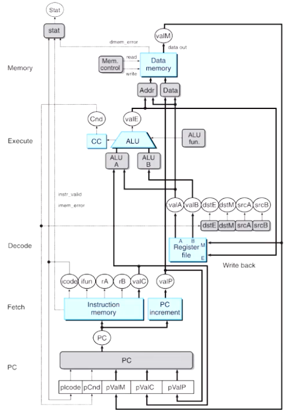
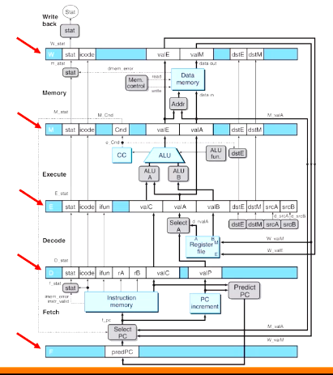
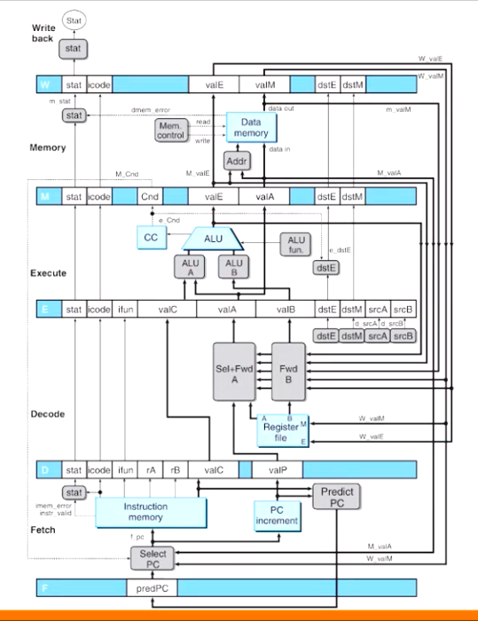

# Computer Systems Organisation (CS2.201)
## Summer 2021, IIIT Hyderabad
## 02 July, Friday (Lecture 17) – Pipelined Y86

Taught by Prof. Avinash Sharma

## Pipelined Y86: SEQ+
SEQ+ is different from SEQ in that the PC update stage is moved to the beginning of the clock cycle – it now calculates the value of the current instruction, instead of the next.

This change makes it more suitable for pipelining.

## Pipelined Y86: PIPE-

### Pipe Registers
PIPE- is a five-stage pipeline obtained by inserting 5 pipeline registers into SEQ+.  
As a general principle, we want to keep all the information about a particular instruction contained in a single pipeline state.

1. Register F stores the predicted value of PC. The PC update stage has to decide between this value, `valA` and `valC`.  
2. Register D stores the output of the fetch stage of the processor.  
3. Register E stores the output of the decode stage and values read from the register file.  
4. Register M holds the results of the most recently executed instruction for processing by the memory stage, as well as information about branch conditions.  
5. Register W feeds the paths to write back to registers and to calculate the next PC (in case of a `ret` instruction).

### Naming Convention
A naming scheme is adopted where a signal stored in a pipeline register can be identified by prefixing its name with the name of the pipe register in uppercase. Thus, we have `D_stat`, `E_stat`, etc. Signals that have just been computed in a stage are identified by prefixing them with the first character of the stage name – thus `f_stat`, `m_stat`, etc.

### Select A
One block of PIPE- that is not quite the same as in SEQ+ is the block labelled "Select A" in the decode stage. It generates `valA` for register E by choosing between `valP` and the value read from the register file. This is because only call and jump instructions require `valP` in the memory and execute stages – neither of which need a value read from the register file.  

### Next PC Prediction
Unless the fetched instruction is a condition brach (like `jle`) or `ret`, we can decide the next PC value from the information obtained in the fetch stage. For `call` and `jmp`, it would be `valC`; else it would be `valP`.

The technique of guessing the branch direction and then initiating the fetching of instructions is known as branch prediction.

Pipe register F stores "predict PC", which is either `valP` or `valC`. In SEQ+, the PC is either this, or `valP` for a not-taken branch instruction that reaches pipe register M (`M_valA`), or the value of the return address when a ret instruction reaches pipe register W (`W_valM`).

### Pipeline Hazards
Dependencies between successive instructions that have a potential to cause an erroneous computation by the pipeline are called hazards. There are two types of such dependencies – data depencies (or data hazards, where values are miscomputed) and control dependencies (or control hazards, where addresses are miscomputed).

Data hazards are avoided by

* stalling, or adding a bubble (which is essentially a `nop` instruction); or
* forwarding, or accessing a different pipe register from the immediately preceding one (which is the normal case).

## Pipelined Y86: PIPE

PIPE- cannot make use of forwarding. Forwarding is implemented in the new PIPE hardware architecture.  

The "Sel+Fwd A" block takes five inputs in order to handle data hazards with forwarding.

Another class of data hazards, called load/use data hazards, cannot be handled simply by forwarding as the memory read occurs much later in the pipeline. It requires a combination of stalling and forwarding.
