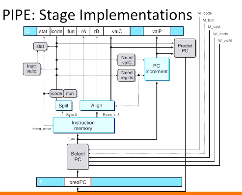
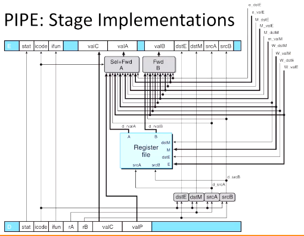
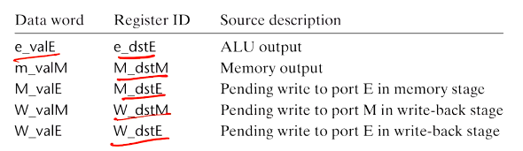
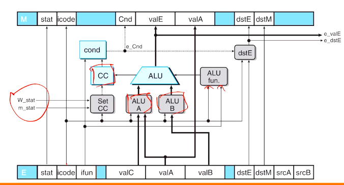
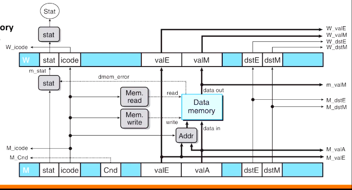

# Computer Systems Organisation (CS2.201)
## Summer 2021, IIIT Hyderabad
## 03 July, Saturday (Lecture 18) – Pipelined Y86 (contd.)

Taught by Prof. Avinash Sharma

## Pipelined Y86: PIPE (contd.)
### Exception Handling
Exceptions are generated either internally or externally. There are three different internally generated exceptions – a halt instruction, an instruction with an invalid combination of instruction and function code, and an attempt to access an invalid address.  
The Y86 processor does not support external exceptions.

We would like the processor to halt when it reaches an exception and to set the appropriate status code. All instructions up to the excepting instruction should have completed, and none of the following.

There are three special cases:

* In cases when multiple instructions trigger exceptions simultaneously, the basic rule is to put priority on the exception triggered by the one that is furthest along the pipeline (*i.e.*, the one that was loaded earlier).
* In case an exception occurs in a mis-predicted branch, it should not be raised.
* When instruction following the excepting instruction alters the state before the latter completes, the pipeline control logic should disable updating of the CC register and the data memory.

All these three types can be handled by the simple and reliable strategy of carrying the exception status together with all the other information about an instruction through the pipeline.

### Stage Implementations

1. PC Update and Fetch Stages: As before, the "predPC" module selects the next value of the program counter using information from the previous instruction and updates it. The fetch stage reads the instruction and stores it in pipe register D.

2. Decode and Write-back Stages: Here, the two selection blocks decide whether to read `valA` and `valB` from the register file, or from the memory or execution stages of the previous instructions, depending on what these instructions were.

    We see here the notion of forwarding priority. A pipelined implementation should always give priority to the forwarding source n the earliest pipeline stage. When the icode signal matches either `call` or `jXX`, this block should select `valP` as output. Otherwise, the following options must be considered.

3. Execute Stage: Here again, the values of the ALU's operands depend on the icode signal, `valA`, `valB` and `valC`.  
    Note, however, that the exceptions go to `W_stat` and `m_stat` – indicating that in those stages, no updating of the state should occur after an exception has been raise in this stage (case 3 above).

4. Memory Stage: Here, the outputs go to the selection blocks of previous stages.
