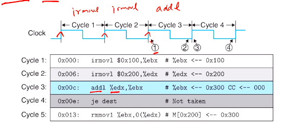
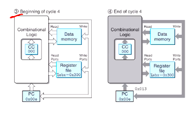

# Computer Systems Organisation (CS2.201)
## Summer 2021, IIIT Hyderabad
## 28 June, Monday (Lecture 15) – SEQ Timing

Taught by Prof. Avinash Sharma

## SEQ Timing
In the operation of the hardware structure, a single clock transition triggers a flow through combinational logic to execute an entire instruction.

The implementation of SEQ consists of combinational logic and two forms of memory: clocked registers and RAM (the register file and the instruction and data memory).

We can consider reading from RAM as similar to combinational logic: an output word is generated based on the address input. This is a reasonable assumption for small memory and can be mimicked for larger circuits.

There are only four hardware units that require sequencing control – the program counter, the CC register, the data memory and the register file.

These are all controlled by a single clock signal:

* the PC is loaded with a new instruction address every cycle
* the CC register is loaded only when an integer operation instruction is executed
* the data memory is written only when `rmmovl`, `pushl` or `call` instruction is executed
* the register file allows up to two registers to be updated on every cycle

The SEQ hardware achieves the same effect as a sequential execution would, although in fact all the state updates occur simultaneously. This equivalence holds because the design follows the following principle:  
The processor never needs to read back the state updated by an instruction in order to complete the processing of this instruction.

For example, the implementation of `pushl` reads the stack-top from `%esp` first and then decrements it. Implementing it the other way around would have violated the above principle.

Consider the Y86 code
    
    0x000:  irmovl $0x100, %ebx
    0x006:  irmovl $0x200, %edx
    0x00c:  addl %edx, %ebx
    0x00e:  je dest
    0x013:  rmmovl %ebx, 0(%edx)
          dest:
    0x019:  halt
    

All the `irmovl` instructions take one cycle each.

At the beginning of cycle 3, the CCs were `100`. By the end, `000` is being written to the CC register. Similarly, the PC is about to be written by the instruction address `0x00e`, and `%ebx` with the value `0x300`. But the loading will not actually happen until the next clock cycle starts.

Immediately after the clock edge, the CCs are `000` and the PC is `0x00e`. The value `ZF` tells the processor to simply increment the PC and not jump; therefore, by the end, of the cycle, `0x013` is about to be loaded into PC.

## SEQ Stage Implementations
### Fetch
This unit reads 6 bytes from memory at a time, using the PC as the address of the first byte. In case of a memory error, the signal is sent to icode to replace the instruction read with `nop`.  
Whether or not the instruction includes registers and/or an immediate value is indicated by 'need regids' and 'need `valC`', taken from icode; according to these, the PC value increments and generates `valP`.  
The hardware unit 'Align' uses the value of 'need regids' to identify whether the next bytes are register IDs or not. It also generates the constant word `valC`.

### Decode and Write-Back
These two stages are combined as they both access the register file. The register file allows up to two simultaneous reads (A and B) and two simultaneous writes (E and M), each of which has an address and a data connection.  
The four blocks at the bottom generate the register IDs for the register file based the icode and the condition code Cnd.

