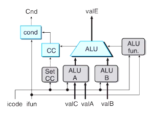
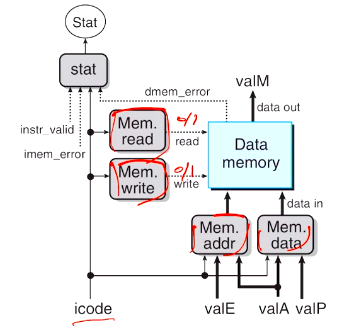
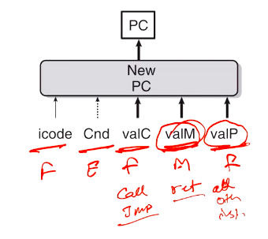
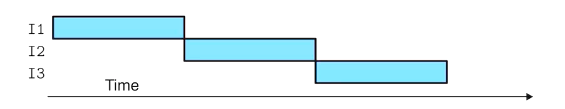
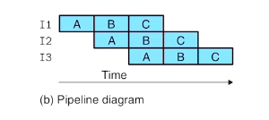
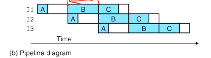

# Computer Systems Organisation (CS2.201)
## Summer 2021, IIIT Hyderabad
## 30 June, Wednesday (Lecture 16) – SEQ Stage Implementations

Taught by Prof. Avinash Sharma

## SEQ Stage Implementations (contd.)
### Execute
The data and control signal are generated by three control blocks – one that decides the operation and two that decide the operands. The ALU output becomes the `valE` signal and also sets the condition codes.  
The `cond` unit decides whether or not to execute the instruction based on the ifun and Cnd.

### Memory
Based on icode, the four control blocks decide whether to read or write, and if the latter. If the former, the address is given; if the latter, the address and the data.  
If read is performed, the value `valM` is generated.

### PC Update 
This is the final stage and it decides the new value of the program counter, which is one of `valC`, `valM` or `valP`.

## Pipelined Instruction Processing
Note: the throughput is calculated as number of instructions divided by the time elapsed (latency). For instance, if one instruction takes 320 ps, then the throughput is 3.12 GIPS (giga-instructions per second).

In unpipelined hardware, one instruction is fully executed before the next one begins to be.

In pipelined hardware, the instructions overlap. This improves the throughput considerably.

In practice, the stages are not always partitioned uniformly. Therefore, the length of one clock cycle would be the time taken to execute the longest stage.

However, deep pipelining gives diminishing returns. The percentage increase of throughput with each stage of pipelining successively reduces.  

Frequently, the output of one instruction is used in the input of the next. This means that the instruction has to complete before the next one can begin to be processed. This reduces the efficiency of pipelining.
