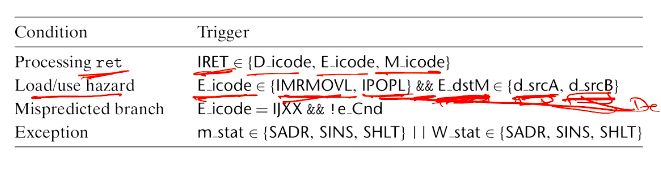
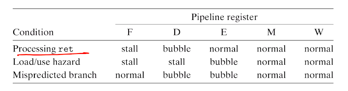
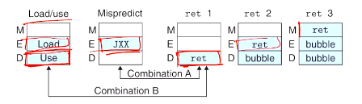
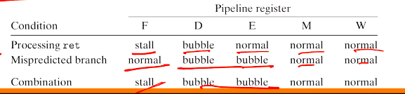
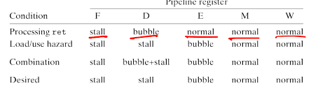
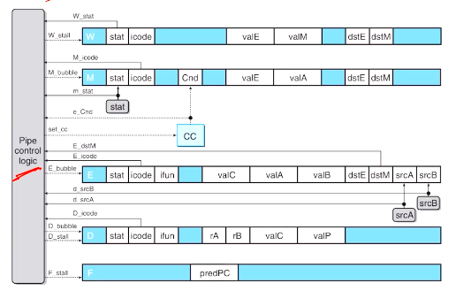

# Computer Systems Organisation (CS2.201)
## Summer 2021, IIIT Hyderabad
## 05 July, Monday (Lecture 19) – Pipelined Y86 (contd.)

Taught by Prof. Avinash Sharma

## Pipelined Y86: PIPE (contd.)
### Pipeline Control Logic
There are four sceniaros which need to be handled:

* processing `ret`: the pipeline must stall until `ret` reaches the write-back stage.
* load/use hazards: the pipeline must stall for one cycle between an instruction that reads from memory and one that uses this value.
* mispredicted branches: the instructions that follow a branch prediction which turns out to be wrong have to be removed from the pipeline.
* exceptions: the programmer-visible state should not be updated by instructions following the excepting instruction, and the pipeline should halt when the excepting instruction reaches the write-back stage.

**Processing `ret`** When `ret` is fetched, the processor stalls for three cycles (until   `ret` reaches write-back.) This is achieved by using bubbles, which replace the icode with `nop` in all stages except fetch.

**Mispredicted Branches** Here, too, bubbles are inserted to allow the processor to wait until the CC register is updated.

**Exceptions** The signals `m_stat` and `W_stat`, when they arrive in the execute state, indicate how to reset the CC register so that it appears as if the programmer-visible state has not been updated.

### Stalling and Bubbles
Consider a register to which input is being fed.

* When both the stall and bubble signals are set to 0, the register loads the input as its new value.
* When the stall signal is 1, the register's updating is disabled; it remains in its previous state irrespective of its input.
* When the bubble signal is 1, the register is set to some reset configuration (equivalent to a `nop` instruction), again irrespective of its input.

To inject a bubble into pipe register D, we have to set the icode field to `INOP`; and for register E, we need to set the icode field to `INOP` and the `dstX` and `srcX` fields to `RNONE`.

The stall and bubble signals are generated by combination blocks.

The control conditions are mostly mutually exclusive, except for two possible combinations.

Combination A involves a `ret` at the target of the not-taken branch. The pipeline logic should cancel the `ret`.

Combination B involves `ret` following an instruction that modifies `%esp`. However, simply combining the conditions will not work here.

Thus, combination B requires some special handling.

