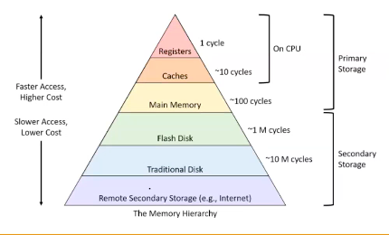
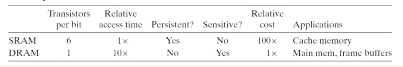
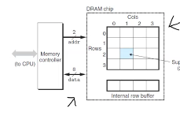

# Computer Systems Organisation (CS2.201)
## Summer 2021, IIIT Hyderabad
## 07 July, Wednesday (Lecture 20) – Memory Hierarchies

Taught by Ziaul Choudhury

## Memory Organisation
### Flat Memory vs Hierarchical Memory
In a flat memory model, the access time for all memory locations is the same. But this is only a theoretical model and not actually implemented.

In a hierarchical model, the access time depends on which memory the data is stored in.

### The Memory Pyramid

The different layers are implemented with different technologies:

* Register – Hardware register
* Cache – SRAM
* Main memory – DRAM
* Flash disk – SDD/EEPROM
* Traditional disk – HDD
* Remote – Web server

## SRAM vs DRAM
SRAM stores each bit in a bistable memory cell, which is implemented with a six-transistor circuit. It can retain memory indefinitely (as long as the power supply holds).

DRAM stores each bit as charge on a capacitor, and the memory system must periodically refresh it (since capacitors get discharged) and rewrite it.

## DRAM
### Structure and Design
The cells in a DRAM chip are partitioned into $d$ supercells, each consisting of $w$ DRAM cells. This stores a total of $dw$ bits of information.

The supercells are organised into a 2-D array, and therefore have addresses of the form $(i,j)$.

When reading, the entire row is shifted out into the internal row buffer (the first address invocation). In the second address invocation, the column number is used to read a single cell from the row. 

A single refresh operation refreshes an entire row.

### Example
The memory module shown can store 64 MB using eight 8M $\times$ 8 DRAM chips (numbered 0 to 7). Each supercell stores one byte of main memory. Each 64-bit doubleword at a byte address is represented by the contents of the eight supercells having that address in the eight chips.

