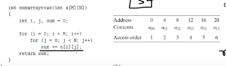
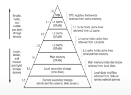

# Computer Systems Organisation (CS2.201)
## Summer 2021, IIIT Hyderabad
## 12 July, Monday (Lecture 22) – Memory Hierarchies

Taught by Ziaul Choudhury

## Memory Pyramid 2.0
Different storage technologies have widely different access times. Faster technologies cost more per byte than slower ones and have less capacity.  

A wait state is defined as a cycle during which the CPU does nothing as it has not received data from the memory. The number of wait states a processor goes through is a measure of the lag between the processing speed and the memory access speed.  

The principle by which adjacent or identical memory blocks are accessed by the code so that memory can be accessed from the cache is called locality (spatial and temporal respectively). For example, the following code exhibits spatial locality w.r.t array access and temporal locality w.r.t variable access.

## Caches
### Principle of Caching
A cache is a smalll, fast storage device that acts as a staging area for the data objects stored in a larger, slower device.  

The central idea of a memory hierarchy is that for each $k$, the faster and smaller storage devices at level $k$ act as caches for the larger and slower devices at level $k + 1$.

When the CPU finds what it needs in the lower level, it is called a hit. Conversely, when it is not available in the lower level, it is called a miss. There are three types of misses:

* cold misses: the initial miss, after which the data is loaded into the lower level.
* conflict miss: when new data is loaded into a partially empty cache but still overwrites some old data.
* capacity miss: when the lower level runs out of memory and loses some old data in order to load new data.
