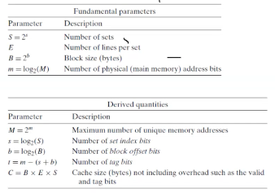

# Computer Systems Organisation (CS2.201)
## Summer 2021, IIIT Hyderabad
## 14 July, Wednesday (Lecture 23) – Memory Hierarchies

Taught by Ziaul Choudhury

## Caches (contd.)
### Structure of the Cache
The cache consists of a storage unit and a controller. The controller decides what is to be stored in the storage unit.  

When memory has to be updated, there are two general principles – write-back (where the block updated in the cache until it is removed, at which point it is updated in the main memory) and write-through (where the updates happen simultaneously in cache and main memory).  

There are two types of caches – direct map caches (where the set bits of an address dictate the position of the block in the cache) and fully associative caches (which can store blocks in any empty positions in the cache).
