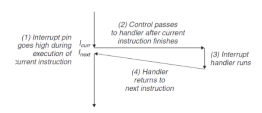

# Computer Systems Organisation (CS2.201)
## Summer 2021, IIIT Hyderabad
## 19 July, Monday (Lecture 25) – Exceptional Control Flow

Taught by Ziaul Choudhury

## Control Flow
### Smooth and Jittery Transitions
When a computer is switched on, the processor moves through a sequence of addresses $a_k$, $a_{k+1}$, and so on. Each $a_i$ is the address of some instruction $I_k$; each transition from $a_i$ to $a_{i+1}$ is called a control transfer.  

A sequence of such transfers is called the control flow of the processor.  

When the control flow occurs in the normal way – sequentially, or by calling functions, or by branching – the transitions are smooth, and other cases' (exceptions, faults, HDD failures) are called jittery transitions.

### Exceptional Control Flow
Exceptional control flow refers to the control flow intended to handle exceptional cases encountered by the processor. It occurs at all levels of a computer system:

* at the hardware level, events detected by the hardware trigger control transfers to exception handlers.
* at the OS level, the kernel transfers control from one user process to another via context switches.
* at the application level, a process can send a signal to another process that transfers control to a signal handler in the recipient.

An individual program can react to errors by making nonlocal jumps to other functions instead of following the usual stack discipline.  

### Why ECF
ECF is the basic mechanism that OSs use to implement I/O, processes and virtual memory.  
Applications request services from the OS by using a form of ECF called a trap or a system call.  S
The OS provides applications with ECF mechanisms for creating new processes, waiting for processes to terminate, notifying other processes of exceptional events, and detecting and responding to these events.  
In software, ECF mechanisms are available in languages like C++ and Java in the form of try, catch and throw statements.

## Exceptions
An exception is an abrupt change in the control flow in response to some change in the processor's state.


### Handling Exceptions
Each type of exception is assigned a unique nonnegative integer exception number. An exception is aking to a procedure call – there is an exception table which contains the address with the code for handling each type of exception.

### Classes of Exceptions
#### Interrupts
They occur asynchronously as a result of signals from I/O devices external to the processor (like keyboard or mouse input). The processor needs to continuously check if the input is received or not; this process is called polling.



#### Traps and System Calls
Traps are intentional exceptions that run as the result of executing an instruction. They are synchronous (generated from within the program). They are used to implement system calls.  
A system call is a call to a function that is part of the OS. For example, the `printf()` statement generates a trap that calls the write and read syscalls. For example, to print `hello, world\n` to standard output, following code might be generated:
```gnuassembler
# calling write(1, "hello, world\n", 13)
movl $4, %eax       # write syscall number
movl $1, %ebx       # stdout code
movl $string %ecx   # string
movl $len, %edx     # length of string
int $0x80           # system call
```


#### Faults
Faults result from error conditions that a handler might be able to correct. An example is the page fault address, which is when a virtual address whose page is not present in the memory and must be retrieved from disk.

#### Aborts
Aborts result from unrecoverable fatal errors, like parity errors that occur when DRAM or SRAM bits are corrupted. Abort handlers never return control to the application program.


