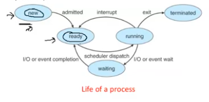

# Computer Systems Organisation (CS2.201)
## Summer 2021, IIIT Hyderabad
## 23 July, Friday (Lecture 26) – Exceptional Control Flow

Taught by Ziaul Choudhury

## Process Flows
### Processes
When an application starts up, the instructions are copied by the loader to the RAM. A running program in memory is called a process.  

A process provides the application the illusion that it has exclusive access to the processor and to the memory. During execution, each process is partially executed, and then preempted (or temporarily suspended), while other processes run.  

### The Abstraction
The memory abstraction is accomplished through a private address space, which is the region of the memory where the application's instruction and data are stored.  

There are two modes – user and kernel. These modes restrict the instructions a process can execute and the addresses it can access. Alternating between these modes during execution allows the program to run other, kernel-level operations (like I/O operations) as well.  

Context switching is moving to another process when one running process halts. When context switching, the processor's state is saved in the CPU and then the move is made.

### System Call Error Handling
When Unix system-level functions encounter an error, they return $-1$ and set the global integer variable `errno` according to the error ID.  

Using error-handling wrappers can simplify our code:
```c
pid_t Fork(void)
{
    pid_t pid;
    if ((pid == fork()) < 0)
        unix_error("Fork error");
    return pid;
}
```

### Process Control
The processor allots a time for each process to run in turn, called a time slice. Once the time slice is expired, if the running process has not automatically halted, context switching must happen. This is done by an interrupt.



Each process has a unique positive process ID or PID. We can find the PID of the calling process using the `getpid()` function and the PID of the calling process's parent (the process that created it) using `getppid()`.  

A parent process creates a new running child process by calling the `Fork()` function.  

The newly created child process is nearly identical to the parent process (the user-level virtual address space and the file descriptors of the parent are copied), but has a different PID.  

The fork function, although it is called once, is returned twice (once in the parent, where it returns the PID of the child; and once in the child, where it returns 0).  

The number of processes created by an application is, in general, $2^{\text{the number of }\mathtt{Fork()}\text{ statements}}$.  

When a process terminates, it is not removed immediately, but instead kept around until it is eaten by its parent. A killled child not eaten becomes a zombie (this happens when a parent is killed before it can eat its child).  
In this situation, the `init()` process kills the zombie. It has a PID of 1 and is created by the kernel during system initialisation.  

A parent waits for its child to die before eating it through the `waitpid()` function.
